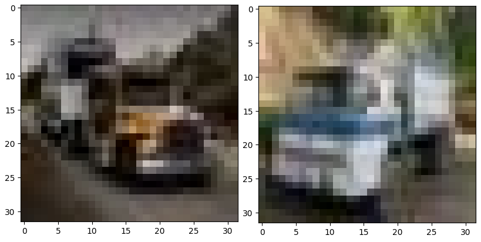
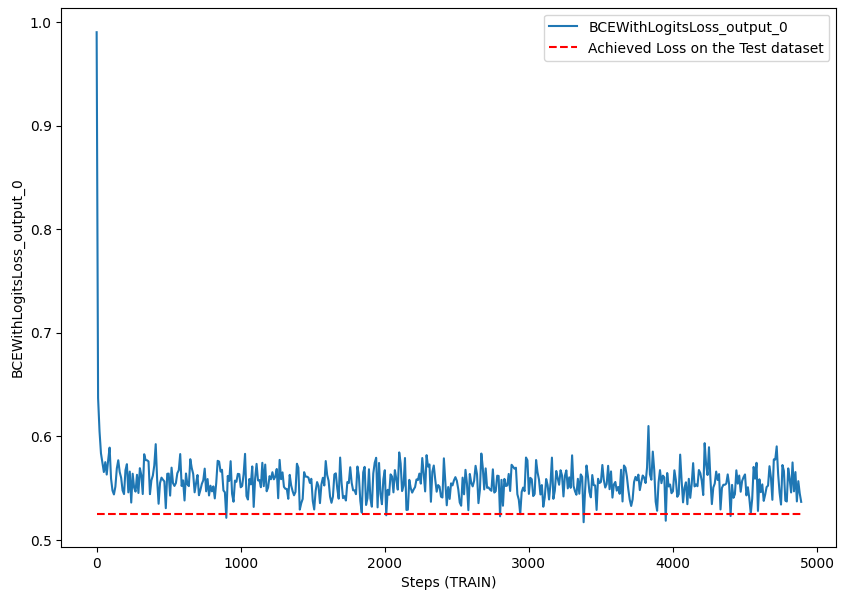
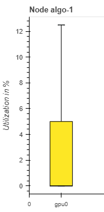
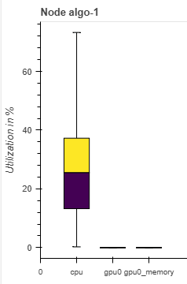
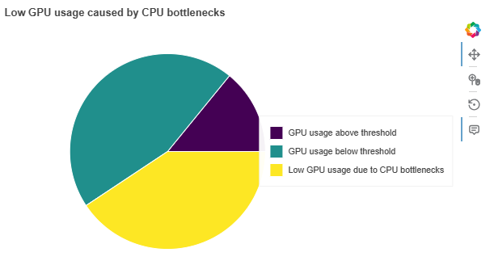

# Detecting Synthetic Images in AWS SageMaker

In this project I attempt to use the [CIFAKE: Real and AI-Generated Synthetic Images](https://www.kaggle.com/datasets/birdy654/cifake-real-and-ai-generated-synthetic-images/data) dataset from kaggle for Computer Vision classification.

This project serves as the capstone project for the AWS Machine Learning Nanodegree by Udacity. In this project I will leverage the usage of AWS SageMaker for preprocessing the data, tuning hyperparameters, training a model, and deploying the model as an endpoint for inference. I will then provide a Step Functions workflow that will allow the triggering of a Lambda Function to predict whether an image uploaded to an S3 bucket is real or fake.

This project is motivated by the raise of Generative AI, and the rapid improvement of its capabilities in image generation. This presents huge opportunities and technological advancements, however, worries about the ability of automatic systems (or even people) to differentiate real from fake images have also been growing.

## Project Setup
The project consists of the following files:
- `train_and_deploy.ipynb`: this notebook contains all the step for dataset analysis, hyperparameter tuning, training of the final model, and deployment of the endpoint.
- `hpo.py`: this Python code contains the creation, training and testing of a fined-tuned Inception v3 neural network, using hyperparameters given from the arguments.
- `train_model.py`: this Python code contains the creation, training and testing of a fined-tuned Inception v3 neural network, using hyperparameters given from the arguments, and adding a hook for the Sagemaker Profiler and Debugger. 
- `requirements.txt`: this file contains the requirements for the hpo and train_model Python files. This is required since the notebook launches the training jobs in a new machine which doesn't have all requirements installed. This file tells Sagemaker which Python libraries to install.
- `README.md`: a comprehensive documentation of the project.

To run this project completely, we only have to execute all the steps in the `train_and_deploy` notebook.

## Libraries/Frameworks used

- [Black formatter](https://github.com/psf/black): PEP8 formatter that helps the project code keep on track with standards.
- [Kaggle](https://www.kaggle.com/): Website that hosts the dataset used for this model.
- [Python3.10](https://www.python.org/downloads/): Latest version of the Python language available in Sagemaker Notebook kernels.

## Development of the project

This project is developed using the resources offered during the AWS Machine Learning Engineer Nanodegree. This includes an AWS account with access to create resources like SageMaker instances, Lambda functions, etc.

### Sagemaker preparation

Firstly I created a Notebook Instance in AWS SageMaker called `detecting-synthetic-images-sagemaker`. This allows me to access a Jupyter environment with Sagemaker and other libraries installed. The instance type for the notebook chosen is the `ml.t2.medium`. I chose this option because no pre-processing of the data is required, and this is the cheapest option available. This instance costs \$0.0464 per hour, and will be shut down when the notebook is not in use.

I also created the S3 bucket where the dataset will reside: `detecting-synthetic-images-sagemaker`. I created an Execution Role with full access to this S3 bucket: `AmazonSageMaker-ExecutionRole-20260311T094833`. This is the role the Sagemaker notebook instance uses.

Finally, I cloned the present repository inside the Notebook Instance.

### Dataset exploration and preprocessing

The dataset used is [CIFAKE: Real and AI-Generated Synthetic Images](https://www.kaggle.com/datasets/birdy654/cifake-real-and-ai-generated-synthetic-images/data) available in Kaggle.

To download and upload the data to S3, I use the Notebook instance created previously. The `train_and_deploy.ipynb` notebook contains cells for downloading the data in a .zip file using the `wget` command, unzipping it in the local Jupyter Folder, and uploading it to S3 into the URI `s3://detecting-synthetic-images-sagemaker/input_data/cifake`.

The dataset is already split in two folders: `train` and `test`. Each of these folders contains two folders, one labeled 'real' and one 'fake'. These are our class labels.

The data is divided as follows:

| Dataset | # of images | % of images labeled REAL | % of images labeled FAKE |
|---------|-------------|-----------------------------|-----------------------------|
| train   | 100,000      | 50% | 50% |
| test   | 20,000      | 50% | 50% |

Every image is 32x32 pixels, with three channels (RGB). Here are two examples of images of the same CIFAR class (truck):


On the left, a synthetically generated image of a truck, on the right, a real photo of a truck

---

For preprocessing the data, Neural Networks benefit from some kind of Normalization of the data, since it helps the models converge faster [[ref]](https://www.digitalocean.com/community/tutorials/batch-normalization-in-convolutional-neural-networks#comparing-models). However, for Inception_v3, we need to apply the Standarization that the documentation indicates, which gives us the mean and standard deviation to apply to the data [[ref]](https://docs.pytorch.org/vision/main/models/generated/torchvision.models.inception_v3.html)

```
mean=[0.485, 0.456, 0.406] 
std=[0.229, 0.224, 0.225]
```

Also, Inception_v3 only accepts images of size (299, 299). Thus, the transformers for the data are the following:

```
transformer = transforms.Compose(
        [
            transforms.Resize((299, 299)), #inception_v3 image size
            transforms.ToTensor(),
            transforms.Normalize(
                mean=[0.485, 0.456, 0.406],
                std=[0.229, 0.224, 0.225],
            ),
        ]
    )
```
### Network created

In my proposal I indicated I would fine-tune the model Inception_v3, conceived in the paper _Rethinking the Inception Architecture for Computer Vision_ [[ref]](https://arxiv.org/abs/1512.00567). However, after further investigation, I have discovered that this network requires the input size to be 299x299 [[ref]](https://docs.pytorch.org/vision/0.11/models.html#inception-v3). CIFAKE has 32x32 images, which when resized as big as Inception_v3 requires, makes this network quite slow to classify, and the resizing does nothing for the images.

I have then investigated which pre-trained networks are available for 32x32 images, and have found VGG as a good candidate [[ref]](https://arxiv.org/pdf/1409.1556). VGG19, the latest version available, is a convolutional network that has top-1 accuracy of 74%.

I have added to VGG19 one final output layer which converts the number of output features of the original network to 1 final output neuron and a Sigmoid activation function, which will give the resulting class (0 or 1) for each image (this function is not defined explicitly in the network, since the loss function implementation used already applies it).

The loss function used is Binary Cross Entropy Loss, which penalizes high confidence predictions on wrong classes, measuring the distance between the prediction and the correct label. BCELoss is dangerous when the dataset is unbalanced, but since we count with the same number of images for both classes, this is not an issue in our case [[ref]](https://blog.dailydoseofds.com/p/the-caveats-of-binary-cross-entropy).

For the specific Pytorch version of this model, I will actually use the class BCEWithLogitsLoss, this loss function combines the Sigmoid activation function and the final Binary Cross Entropy Loss, making it more stable than applying them separately [[ref]](https://docs.pytorch.org/docs/stable/generated/torch.nn.BCEWithLogitsLoss.html#torch.nn.BCEWithLogitsLoss).

Lastly, the optimizer chosen for this task is the ADAM optimizer, this optimizer is very robust and useful with deep, complex Neural Networks [[ref]](https://arxiv.org/abs/1412.6980)

### Hyperparameter Tuning

The first step to create the model is to tune the Hyperparameters. For this I created a python script, `hpo.py` which contains the creation, training, and testing of the Neural Network. The model is trained for a maximum of 100 epochs, but the training stops when it detects that the Training loss has not decreased between epochs. This will accelerate the hyperparameter tuning, after which a full model with the chosen hyperparameters will be trained for all 100 epochs.

The tuner trains 5 different models to find the lowest Loss (defined as the Binary Cross Entropy) between multiple combinations of Learning Rate and Batch Size. This is performed in an instance type `ml.p3.2xlarge`. Due to the restrictions of the Udacity AWS account, only one of these jobs can be run at one time, since only one instance of this type is available. This instance has access to a GPU, so I configured the model  to run in the GPU if available.

After the tuning, here is the final result for all five training jobs:

Rank | Learning rate | Batch Size | Epochs trained for | Loss on Testing dataset | Accuracy on Testing dataset | Recall on Testing dataset |
----------| ------------|-------------|---------------|---------------|-----------|----------|
#1 | 0.0040... | 2048 | 4 | 0.535 | 73.45% | 73.25% |
#2 | 0.0039... | 1024 | 3 | 0.540 | 73.27% | 77% |
#3 | 0.0035... | 512 | 5 | 0.542 | 73.22% | 78.7% |
#4 | 0.0033... | 256 | 4 | 0.602 | 70.07% | 54.36% |
#5 | 0.0025... | 128 | 4 | 0.617 | 71.21% | 66.07% |

The chosen hyperparameters are:
- Learning Rate: 0.004035719481029806
- Batch Size: 2048

After 4 epochs, these parameters achieved an accuracy of 73.45% on the test dataset.

During the training, the hyperparameters tuned, and loss, accuracy and recall between epochs and every 100 batches is recorded in CloudWatch:


### Estimator Training

After deciding on the best hyperparameters to use, I trained the model the full 100 epochs, setting up hooks for the SageMaker Profiler to check for issues during training, and the Debugger to check for multiple rules. This training was also done on an instance type `ml.p3.2xlarge`, I didn't utilize multi-instance training because, as previously stated, only one instance of this type is allowed at the same time in the Udacity AWS account.

After two hours, the training was complete, with a final Test accuracy of **74.92%**, and a Recall of **71.79%**


I activated the following Debugger rules:

- [**Loss Not Decreasing**](https://docs.aws.amazon.com/sagemaker/latest/dg/debugger-built-in-rules.html#loss-not-decreasing): detects when the loss function is not decreasing enough between training steps. 
- [**Vanishing gradient**](https://docs.aws.amazon.com/sagemaker/latest/dg/debugger-built-in-rules.html#vanishing-gradient): detects if the gradients become extremely small or drop to 0.
- [**Exploding tensor**](https://docs.aws.amazon.com/sagemaker/latest/dg/debugger-built-in-rules.html#exploding-tensor): detects if the tensors have infinite or nan values.

During training **NONE** of the rules triggered.

Here plotted is the loss function for the training dataset, the horizontal line denotes the final achieved loss evaluated in the test dataset:



The plot shows a reduction in the loss function, however it's clear that it didn't improve much after the first few steps, which means that more iterations probably wouldn't have improved the network. If given more time, I would try a smaller learning rate value, since high values make the network get "stuck" with worse losses [[ref]](https://stackoverflow.com/questions/42966393/is-it-good-learning-rate-for-adam-method).

---

The Profiler report can shed light on any issues with the utilization of resources. The training job triggered the following alerts:

- **LowGPUUtilization**: Checks if the GPU utilization is low or fluctuating. This can happen due to bottlenecks, blocking calls for synchronizations, or a small batch size.
- **BatchSize**: Checks if GPUs are underutilized because the batch size is too small. To detect this problem, the rule analyzes the average GPU memory footprint, the CPU and the GPU utilization.
- **CPUBottleneck**: Checks if the CPU utilization is high and the GPU utilization is low. It might indicate CPU bottlenecks, where the GPUs are waiting for data to arrive from the CPUs. The rule evaluates the CPU and GPU utilization rates, and triggers the issue if the time spent on the CPU bottlenecks exceeds a threshold percent of the total training time. The default threshold is 50 percent.

The profiler detected that GPU utilization fluctuated a lot:



The BatchSize rule was triggered because it detected that the Batch Size was too small for the instance chosen. This means I could potentially save costs by lowering the instance, or make the training faster by increasing the batch size.



Lastly, the CPU bottleneck was triggered because CPU usage was very high and GPU usage low. The profiler detected that the CPU acted as bottleneck 68% of the time. It displays a plot that shows which percentage of time the GPU usage was low due to the CPU:



In conclusion, the training of this model uses an instance which has a GPU but has only 8 CPUs, causing the instance to be infra-utilized. As a point of improvement, the model could be retrained using an instance that doesn't have a GPU, or with an instance with a higher number of CPUs, however this last measure would cause the price to increase.

The full Profiler report is available in profiler-report.html

### Model Deployment and Inference

The model is deployed from the trained estimator to an endpoint. The instance used is `ml.t2.medium`, which is the cheapest instance available for inference, and it's more than enough to attend the small amount of traffic in this project.

I then tested it with an example of a fake image from the test dataset, which the network correctly identified with a confidence of 69%:

