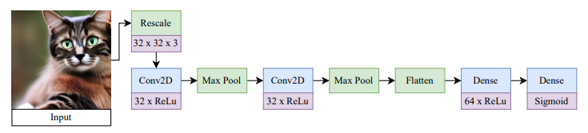

# Detecting Synthetic Images in AWS SageMaker

## Domain Background

This project attempts to solve a problem with rising repercussions in our day-to-day life, the detection of computer-generated images.

As Generative AI improves, its outputs are getting better and better, which helps us in many ways, but also makes it ever so difficult to distinguish between reality and AI generated content.

In terms of image generation, almost all mainstream LLMs are capable of implementing some sort of image generating algorithm, like Image for ChatGPT or Nano banana for Gemini. These algorithms have as their objective to create images that are as close as technologically possible to what the user asks, including achieving photo-realism.

## Problem Statement

As photo-realism is achieved with LLMs, rises the issue of differentiating these images from real photos. Of special importance is this in the field of communication in social media, or even traditional media, where some cases of 'Deep Fakes' have caused missinformation to be widespread.


## Solution Statement

The proposed solution is to train a Computer Vision model to classify photo-realistic images in two categories: Real or Fake.

To do this, we start with a pre-trained model, [Inceptionv3](https://arxiv.org/abs/1512.03385). I have chosen this model because it has very good top-1 accuracy, is available within Pytorch, and it is relatively light-weight compared to others, which will aid with time and budget constraints.

With this pre-trained model we will add a fully-connected network with a 2-neuron output, to classify into binary classes, which will allow us to feed it new images to be classified as real or fake.

## Dataset and Inputs

For this project I will use the [CIFAKE dataset from Kaggle](https://www.kaggle.com/datasets/birdy654/cifake-real-and-ai-generated-synthetic-images/data). The CIFAKE dataset includes 60,000 examples of synthetically generated images labelled as FAKE, and another 60,000 examples of real images (collected from CIFAR-10).

This extensive dataset includes many high-quality synthetically generated images:


The images labeled as 'Real' are from the CIFAR dataset, which has a variety of images of 10 objects: planes, cars, birds, cats, deer, dogs, frogs, horses, boats and trucks. The CIFAKE dataset adds examples of pictures of these objects and animals generated synthetically.

The images have been previously separated into test and train datasets, with 50,000 images for the train dataset for each class, and 10,000 images for the test dataset for each class. The images are available as 32 by 32 pixels, with 3 channels (RGB).

The folder distribution of the dataset is as follows:
```
test
| - FAKE
|   - 0.jpg
|   - ...
| - REAL
|   - 0000.jpg
|   - ...

train
| - FAKE
|   - 1000.jpg
|   - ...
| - REAL
|   - 0000.jpg
|   - ...
```

## Benchmark Model

This dataset has been used with success in the following paper: [Bird, J.J. and Lotfi, A., 2024. CIFAKE: Image Classification and Explainable Identification of AI-Generated Synthetic Images](https://ieeexplore.ieee.org/abstract/document/10409290) with an average classification accuracy  of **91.79%**.

This paper uses a Convolutional Neural Network for classification, comparing 36 different topologies to reach the optimal accuracy of **92.98%**. None of the topologies use a final densely connected layer, which means that a high accuracy can be achieved without a too-complicated network architecture, just by extracting the features using convolutions.

The benchmark model uses Binary Cross-Entropy Loss as its loss function, and an activation function Sigmoid.

This is one of the final model architectures:


## Evaluation Metrics

We are presented with a problem of binary classification, with very well-balanced classes (same number of examples for both classes). Because of this, I propose the usage of **Accuracy** as the metric used to report the result:

$\text{Accuracy} = \frac{\text{correctly classified observations}}{\text{total observations}}$

Also of relevance, we will analyse the **Recall** of the model, that is, what percentage of real images are labeled correctly. A low Recall indicates the presence of many false-negatives, or images that are real but incorrectly identified as 'fake':

$\text{Recall} = \frac{\text{True positives}}{\text{True positives} + \text{False negatives}}$