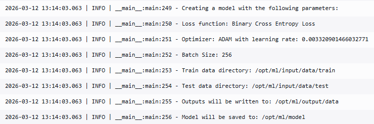
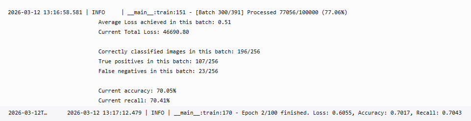
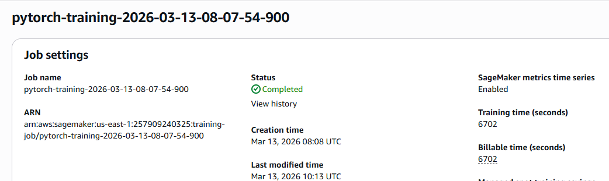

In this project I attempted to use the CIFAKE: Real and AI-Generated Synthetic Images @bird_2024_cifake dataset from kaggle for Computer Vision classification.

This project serves as the capstone project for the AWS Machine Learning Nanodegree by Udacity. In this project I leveraged the usage of AWS SageMaker for preprocessing the data, tuning hyperparameters, training a model, and deploying the model as an endpoint for inference. I also provide a Step Functions workflow that allows the triggering of a Lambda Function to predict whether an image uploaded to an S3 bucket is real or fake.

This project is motivated by the raise of Generative AI, and the rapid improvement of its capabilities in image generation. This presents huge opportunities and technological advancements, however, worries about the ability of automatic systems (or even people) to differentiate real from fake images have also been growing.

# Project Definition

As Generative AI improves, its outputs are getting better and better, which helps us in many ways, but also makes it ever so difficult to distinguish between reality and AI generated content.

In terms of image generation, almost all mainstream LLMs are capable of implementing some sort of image generating algorithm, like Image for ChatGPT @a2025_the or Nano Banana for Gemini @a2026_nano. These algorithms have as their objective to create images that are as close as technologically possible to what the user asks, including achieving photo-realism. @lei_2025_imaginee

## Problem Statement

As photo-realism is achieved with LLMs, rises the issue of differentiating these images from real photos. Of special importance is this in the field of communication in social media, or even traditional media, where some cases of 'Deep Fakes' have caused missinformation to be widespread.

## Solution Statement

The proposed solution is to train a Computer Vision model to classify photo-realistic images in two categories: Real or Fake.

To do this, we start with a pre-trained model, VGG @simonyan_2015_very with which we will perform Transfer Learning. Originally in my proposal I had chosen the Inceptionv3 model @he_2015_deep, however, soon into the project I realised that this model only accepts images sized 299x299, the CIFAKE dataset has images size 32x32, no higher-resolution version is available openly, and the big image size caused the network training to be extremely slow. Also, the resizing didn't add any new information to the images.

VGG, however, accepts 32x32 image size, is lightweight and available within Pytorch, which means it's a good alternative for the problem.

With this pre-trained model I added a final output layer of one neuron with a Sigmoid activation function, giving a result between 0 and 1. Predictions closer to 0 means the network detected the image as FAKE, and closer to 1 as REAL.

## Metrics

This dataset has been used with success in papers like _Image Classification and Explainable Identification of AI-Generated Synthetic Images_ @bird_2024_cifake with an average classification accuracy  of **91.79%**.

We are presented with a problem of binary classification, with very well-balanced classes (same number of examples for both classes), so I used **Accuracy** as the main metric used to report the result:

$$\text{Accuracy} = \frac{\text{correctly classified observations}}{\text{total observations}}$$

Also of relevance, I analysed the **Recall** of the model, that is, what percentage of real images are labeled correctly. A low Recall indicates the presence of many false-negatives, or images that are real but incorrectly identified as 'fake':

$$\text{Recall} = \frac{\text{True positives}}{\text{True positives} + \text{False negatives}}$$

Recall is a relevant metric, since it's desirable to avoid labeling real images as fake, while letting some fake images be labelled as real is more acceptable in this problem.

# Analysis

In this section I discuss the dataset used, the network that was trained, and set up a benchmark for comparation of the final result.

## Data Exploration

The dataset used is [CIFAKE: Real and AI-Generated Synthetic Images](https://www.kaggle.com/datasets/birdy654/cifake-real-and-ai-generated-synthetic-images/data) @bird_2024_cifake available in Kaggle.

This dataset contains real images taken from the CIFAR-10 dataset @krizhevsky_2009_cifar10, and fake images generated synthetically using the same classes that the CIFAR dataset represents (e.g. truck, cat, frog, ship...)

The dataset is already split in two folders: `train` and `test`. Each of these folders contains two folders, one labeled 'REAL' and one 'FAKE'. These are our class labels.

The data is divided as follows:

| Dataset | # of images | % of images labeled REAL | % of images labeled FAKE |
|---------|-------------|-----------------------------|-----------------------------|
| train   | 100,000      | 50% | 50% |
| test   | 20,000      | 50% | 50% |

Every image is '.jpeg' format, with size 32x32 pixels and three channels (RGB). [](#example_truck) shows two examples of images of the same CIFAR class (truck).

```{figure} img/examples_cifake.png
---
label: example_truck
alt: Example of a truck with CIFAKE
align: center
---
On the left, a synthetically generated image of a truck, on the right, a real photo of a truck
```

## Exploratory Visualization

To better explore the images, [](#example_mult) plots multiple real images and fake images, (some of which are the same CIFAR class) side by side, real images on the left, fake ones on the right.

```{figure} img/examples_cifake_2.png
---
width: 200px
label: example_mult
alt: Examples of multiple classes with CIFAKE
align: center
---
Real and Fake images of classes 'plane', 'deer', 'boat', 'frog', 'car', 'dog' and 'horse' side by side.
```

In the fake images, some artefacts are present, for example, the shape of the legs of the frog in the 4th image. These will help the network correctly classify the images.

## Algorithms and Techniques

In my proposal I indicated I would fine-tune the model Inception_v3, conceived in the paper _Rethinking the Inception Architecture for Computer Vision_ @szegedy_2015_rethinking. However, after further investigation, I discovered that this network requires the input size to be 299x299 @a2017_torchvisionmodels. CIFAKE has 32x32 images, which when resized as big as Inception_v3 requires, made this network quite slow to classify, and the resizing did not add value to the images.

I then investigated which pre-trained networks are available for 32x32 images, and found VGG as a good candidate @simonyan_2015_very. VGG19, the latest version available, is a convolutional network that has top-1 accuracy of 74%.

I added to VGG19 one final output layer which converts the number of output features of the original network to 1 final output neuron and a Sigmoid activation function, which will give a result between 0 and 1 for each image (this function is not defined explicitly in the network, since the loss function implementation used already applies it). The closer to 0, the more confident the network is that the image is fake, and the closer to 1, the more confident it's real.

The loss function used is Binary Cross Entropy Loss, which penalizes high confidence predictions on wrong classes, measuring the distance between the prediction and the correct label. BCELoss is dangerous when the dataset is unbalanced, but since we count with the same number of images for both classes, this is not an issue in our case @chawla_2024_the.

For the specific Pytorch version of this model, I will actually use the class BCEWithLogitsLoss, this loss function combines the Sigmoid activation function and the final Binary Cross Entropy Loss, making it more stable than applying them separately @pytorchcontributors_2023_bcewithlogitsloss.

Lastly, the optimizer chosen for this task is the ADAM optimizer, this optimizer is very robust and useful with deep, complex Neural Networks @kingma_2014_adam.

## Benchmark

For the benchmark, as stated, VGG has a top-1 accuracy on multi-classification problems of 74%, however, since this problem is of binary-classification, and the original paper that used the dataset achieved a result of over 90% average accuracy, I expect to get at least the same accuracy as VGG, around 74% accuracy on the test dataset.

# Methodology

This project was developed using the resources offered during the AWS Machine Learning Engineer Nanodegree. This includes an AWS account with access to create resources like SageMaker instances, Lambda functions, etc.

## Sagemaker preparation

Firstly I created a Notebook Instance in AWS SageMaker called `detecting-synthetic-images-sagemaker`. This allowed me to access a Jupyter environment with Sagemaker and other libraries installed. The instance type for the notebook chosen is the `ml.t2.medium`. I chose this option because no pre-processing of the data is required, and this is the cheapest option available. This instance costs \$0.0464 per hour, and was shut down when the notebook was not in use.

I also created the S3 bucket where the dataset will reside: `detecting-synthetic-images-sagemaker`. I created an Execution Role with full access to this S3 bucket: `AmazonSageMaker-ExecutionRole-20260311T094833`. This is the role the Sagemaker notebook instance used.

Finally, I cloned the present repository inside the Notebook Instance.

## Data preprocessing

To download and upload the data to S3, I used the Notebook instance created previously. The `train_and_deploy.ipynb` notebook contains cells for downloading the data in a .zip file using the `wget` command, unzipping it in the local Jupyter Folder, and uploading it to S3 into the URI `s3://detecting-synthetic-images-sagemaker/input_data/cifake`.

For preprocessing the data, Neural Networks benefit from some kind of Normalization of the data, since it helps the models converge faster @oreolorunoluipinlaye_2022_batch. However, for the VGG pre-trained model, I needed to apply the Standarization that the documentation indicates, which gives us the mean and standard deviation to apply to the data @a2024_vgg19_bn:

```{code}
mean=[0.485, 0.456, 0.406] 
std=[0.229, 0.224, 0.225]
```

Thus, the transformers define to preprocess the data are the following:

```{code}
transformer = transforms.Compose(
        [
            transforms.ToTensor(),
            transforms.Normalize(
                mean=[0.485, 0.456, 0.406],
                std=[0.229, 0.224, 0.225],
            ),
        ]
    )
```

## Hyperparameter Tuning

The first step to create the model is to tune the Hyperparameters. For this I created a python script, `hpo.py` which contains the creation, training, and testing of the Neural Network. The model is trained for a maximum of 100 epochs, but the training stops when it detects that the Training loss has not decreased between epochs. This will accelerate the hyperparameter tuning, after which a full model with the chosen hyperparameters will be trained for all 100 epochs.

The tuner trains 5 different models to find the lowest Loss (defined as the Binary Cross Entropy) between multiple combinations of Learning Rate and Batch Size. This is performed in an instance type `ml.p3.2xlarge`. Due to the restrictions of the Udacity AWS account, only one of these jobs can be run at one time, since only one instance of this type is available. This instance has access to a GPU, so I configured the model  to run in the GPU if available.

After the tuning, here is the final result for all five training jobs:

Rank | Learning rate | Batch Size | Epochs trained for | Loss on Testing dataset | Accuracy on Testing dataset | Recall on Testing dataset |
----------| ------------|-------------|---------------|---------------|-----------|----------|
#1 | 0.0040... | 2048 | 4 | 0.535 | 73.45% | 73.25% |
#2 | 0.0039... | 1024 | 3 | 0.540 | 73.27% | 77% |
#3 | 0.0035... | 512 | 5 | 0.542 | 73.22% | 78.7% |
#4 | 0.0033... | 256 | 4 | 0.602 | 70.07% | 54.36% |
#5 | 0.0025... | 128 | 4 | 0.617 | 71.21% | 66.07% |

The chosen hyperparameters are:
- Learning Rate: 0.004035719481029806
- Batch Size: 2048

After 4 epochs, these parameters achieved an accuracy of 73.45% on the test dataset.

During the training, the hyperparameters tuned, and loss, accuracy and recall between epochs and every 100 batches is recorded in CloudWatch:





## Estimator Training

After deciding on the best hyperparameters to use, I trained the model the full 100 epochs, setting up hooks for the SageMaker Profiler to check for issues during training, and the Debugger to check for multiple rules. This training was also done on an instance type `ml.p3.2xlarge`, I didn't utilize multi-instance training because, as previously stated, only one instance of this type is allowed at the same time in the Udacity AWS account.

After two hours, the training was complete, with a final Test accuracy of **74.92%**, and a Recall of **71.79%**



### Debugging

During training I configured the following Debugger rules:

- [**Loss Not Decreasing**](https://docs.aws.amazon.com/sagemaker/latest/dg/debugger-built-in-rules.html#loss-not-decreasing): detects when the loss function is not decreasing enough between training steps. 
- [**Vanishing gradient**](https://docs.aws.amazon.com/sagemaker/latest/dg/debugger-built-in-rules.html#vanishing-gradient): detects if the gradients become extremely small or drop to 0.
- [**Exploding tensor**](https://docs.aws.amazon.com/sagemaker/latest/dg/debugger-built-in-rules.html#exploding-tensor): detects if the tensors have infinite or nan values.

For this instance of training, **NONE** of the rules triggered.

[](#plot_loss) shows the loss function for the training dataset, the horizontal line denotes the final achieved loss evaluated in the test dataset.

```{figure} img/plot_loss.png
---
label: plot_loss
alt: Loss plotted
align: center
---
Evolution of the loss function value over the training dataset with each step of training
```

The plot shows a reduction in the loss function, however it's clear that it didn't improve much after the first few steps, which means that more iterations probably wouldn't have improved the network. If given more time, I would try a smaller learning rate value, since high values make the network get "stuck" with worse losses @is.

### Profiling

The Profiler report can shed light on any issues with the utilization of resources. The training job triggered the following alerts:

- **LowGPUUtilization**: Checks if the GPU utilization is low or fluctuating. This can happen due to bottlenecks, blocking calls for synchronizations, or a small batch size.
- **BatchSize**: Checks if GPUs are underutilized because the batch size is too small. To detect this problem, the rule analyzes the average GPU memory footprint, the CPU and the GPU utilization.
- **CPUBottleneck**: Checks if the CPU utilization is high and the GPU utilization is low. It might indicate CPU bottlenecks, where the GPUs are waiting for data to arrive from the CPUs. The rule evaluates the CPU and GPU utilization rates, and triggers the issue if the time spent on the CPU bottlenecks exceeds a threshold percent of the total training time. The default threshold is 50 percent.

The profiler outputs [](#gpu_ut), which shows that GPU utilization fluctuated a lot, but most of the time was under-utilized.

```{figure} img/GPU_utilizacion.png
:width: 200px
:label: gpu_ut
:alt: % GPU utilization
:align: center
Boxplot showing the percentage of GPU utilization detected during training
```

The BatchSize rule was triggered because it detected that the Batch Size was too small for the instance chosen. This means I could potentially save costs by lowering the instance, or make the training faster by increasing the batch size.

Lastly, the CPU bottleneck was triggered because CPU usage was very high and GPU usage low. The profiler detected that the CPU acted as bottleneck 68% of the time. [](#pie) shows what percentage of training the GPU usage was low due to the CPU being a bottleneck.

```{figure} img/pie.png
:width: 400px
:label: pie
:alt: Low GPU caused
:align: center
Pie plot showing the percentage of the total training time that the GPU utilization was below threshold due to CPU bottleneck
```

In conclusion, the training of this model uses an instance which has a GPU but has only 8 CPUs, causing the instance to be infra-utilized. As a point of improvement, the model could be retrained using an instance that doesn't have a GPU, or with an instance with a higher number of CPUs, however this last measure would cause the price to increase.

The full Profiler report is available in the file `profiler-report.html`.

## Model Deployment and Inference

The model is deployed from the trained estimator to an endpoint. The instance used is `ml.t2.medium`, which is the cheapest instance available for inference, and it's more than enough to attend the small amount of traffic in this project.

I tested the endpoint from the notebook with an example of a real image from the test dataset, which the network identified as REAL with a confidence of 58%:

```{image} img/example_real_image_endpoint.png
:alt: Real image passed to the endpoint for classification
:width: 300px
:align: center
```

```{image} img/example_real_predict.png
:alt: Prediction obtained
:width: 600px
:align: center
```

## Step Functions and Lambda for Inference

Finally, I created three lambda functions, which orquestrated with a Step Functions workflow, capture an image uploaded to the s3 bucket: `detecting-synthetic-images-sagemaker`, serialize it, asks the sagemaker endpoint for classification as real or fake, and checks against a threshold if the inference is confident enough to output to the user.

### Lambda 1 - serializeImage

This lambda is created with a runtime of Python3.10 and assigned an execution role that has access every bucket in S3, to ensure it can access any image that is passed to it.

```{image} img/serializeImage_policies.png
:alt: Policies attached to the lambda serializeImage
:width: 770px
:align: center
```

This lambda reads from the input the bucket and path to the image, saves it to a temporary folder, loads it as a `numpy` array and then serializes it using `pickle`. Besides numpy, this lambda needs the `pillow` library as dependency, we achieve this by adding two Lambda Layers, one with `pandas` and the other one with `pillow`:

```{image} img/lambda_layers.png
:alt: Lambda layers in the serializeImage function
:width: 770px
:align: center
```

The function returns an attribute `image_data` with the serialized value for the given image:


```{image} img/serializeImage_output.png
:alt: Response serializeImage
:width: 770px
:align: center
```

The code is in the file `src/lambdas/serializeImage/lambda_function.py`.

### Lambda 2 - classifyImage

This lambda needs to access Torchvision to apply the transformers, which is not installed by default in Lambda. This can be achieved with layers, unfortunately, lambda layers have a size restriction that doesn't allow the zip files uploaded to define them to be too big.

Thus, this lambda is created as a **containerized** lambda. This kind of function is defined with a `Dockerfile`, `lambda_function.py` and a `requirements.txt` file, with which the torchvision library among others can be installed. The files are under `src/lambdas/imageClassifier`.

I first created a new private repository with AWS ECR (Elastic Container Registry):

```{image} img/ecr.png
:alt: Private repository created in ECR
:width: 770px
:align: center
```

Then I followed the instructions to push the Docker image into the repository:

```{code}
:linenos:

docker build -t detecting_synthetic_images/image_classifier_lambda . --provenance=false
docker tag detecting_synthetic_images/image_classifier_lambda:latest \
    257909240325.dkr.ecr.us-east-1.amazonaws.com/detecting_synthetic_images/\
    image_classifier_lambda:latest
docker push 257909240325.dkr.ecr.us-east-1.amazonaws.com/detecting_synthetic_images/\
    image_classifier_lambda:latest
```

After which I created the lambda function as a container function using the Docker image pushed to the ECR:

```{image} img/classifyImage.png
:alt: Function classifyImage created
:width: 770px
:align: center
```

I attached an inline policy to the execution role `classifyImage-role-vpm8muyz` to invoke the Sagemaker Endpoint:

```{image} img/classifyImage_policies.png
:alt: Policies attached to the classifyImage role
:width: 770px
:align: center
```

I also configured the Lambda's timeout to be 5 minutes, since the default of 3 seconds is not enough to transform the image and receive the inference.

Since the endpoint name can change, I defined an environment variable in the Lambda with the name of the endpoint, which the function uses.

```{image} img/environ.png
:alt: Environment variable Lambda
:width: 770px
:align: center
```

This function returns an atribute 'inference' with the float value for the prediction:

```{image} img/inference_result.png
:alt: Result of the inference outputted by the lambda function
:width: 770px
:align: center
```

### Lambda 3 - checkThreshold

This last function takes the response of the previous one as input, and fails in case the prediction confidence is under a threshold (by default, 60%). In case that the prediction confidence is over the treshold, it returns an object with a 'result' attribute that determines whether the image is REAL or FAKE:

```{image} img/threshold_met.png
:alt: Output of the function when the threshold is met
:width: 770px
:align: center
```

### Step Functions

As the last step, I put together all three functions in a Step Functions workflow, called detectSyntheticImage. This workflow can be called with an s3_bucket and s3_key pointing to a JPG image, and it will output:
- 'REAL' as the `result` attribute of the response if it was detected with confidence that the image is real.
- 'FAKE' as the `result` attribute of the response if it was detected with confidence that the image is fake.
- The last function will **fail** if the network didn't return whether the image was REAL or FAKE with enough confidence.

```{image} img/step_functions_workflow.png
:alt: Resulting Step Functions workflow
:width: 770px
:align: center
```

# Conclusion

During this project I created and trained a model for the purpose of synthetic image detection. I achieved an accuracy of 74% in the testing dataset, which is as good as the maximum achieved by VGG (the underlying pre-trained model) in multi-class classification @simonyan_2015_very.

As well as generating a model, I deployed it to an endpoint that could serve predictions with low latency, and created an example Step Functions flow for classification of images uploaded to S3.

The original paper that used CIFAKE @bird_2024_cifake shows a much higher accuracy, so this model could be further improved by changing the underlying pre-trained model, augmenting the number of layers, further training hyperparameters, or applying data-augmentation techniques. However, the underlying code structure is prepared for changes like this, e.g. if a new model is to be trained, only the `hpo.py` or `train_model.py` files need to be changed, since the notebook can perform the deployment of the new model to a new endpoint, which can then be modified in the environmental variable of the Lambda function `classifyImages` to keep the workflow working, making any changes in the endpoint transparent for the final application.